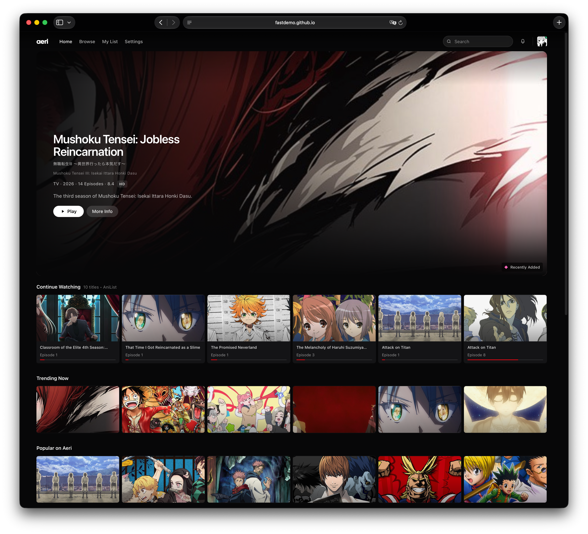

# Aeri

A minimal anime discovery, tracking, and streaming web app.

## Highlights

Aeri is built to feel more like a modern streaming service than an anime database. Browse anime, keep track of what you're watching, and find something new from your favorite pirate bay sources without the ads and distractions!

**Live here at:** `https://fastdemo.github.io/aeri/#/`

## Preview



## Features

* **Anime discovery**: Browse trending, popular, airing, and recently released anime.
* **Search**: Search through real anime data with live results.
* **Anime tracking**: Sync your watch status, ratings, and progress with AniList & MyAnimeList.
* **Episode tracking**: Aeri remembers your episode progress locally.
* **Anime details**: View descriptions, covers, studios, genres, characters, relations, and other metadata.
* **Seasons & series**: Related anime are grouped together into series and seasons where possible.
* **Responsive design**: Works across desktop and smaller screens.
* **Caching**: Frequently used data is cached locally for a faster experience.
* **PWA**: Install Aeri like an app on supported browsers.

## Development

Aeri is built with **React, TypeScript, Vite, and Tailwind CSS**. It runs entirely in the browser and is hosted through GitHub Pages.

The project uses **HashRouter** so routes work properly on GitHub Pages without needing a backend.

Anime data comes primarily from **AniList**, with **MyAnimeList** used for tracking support. Local preferences and watch progress are stored using `localStorage` and IndexedDB.

There is currently **no backend**.

## Structure

```text
src/
  components/       UI components
  pages/            Main application pages
  providers/        AniList, MAL, and video integrations
  storage/          Local storage and IndexedDB
  recommendations/  Recommendation system
  data/             Anime data and development content
  lib/              Shared utilities
  styles/           Global styles and design tokens
```

More detailed project rules and architecture can be found in `AGENTS.md` and `docs/`.

## Development Phases

* [x] **Phase 1** - Foundation, routing, design system, and GitHub Pages setup
* [x] **Phase 2** - Full visual prototype with mock anime data
* [x] **Phase 3** - AniList integration, authentication, list syncing, progress, status, and ratings
* [x] **Phase 4** - Real anime discovery, metadata, trending, popular, airing, search, and dynamic hero content
* [x] **Phase 5** - MyAnimeList integration with PKCE authentication and list syncing
* [x] **Phase 6** - Complete AniList discovery, browse filters, pagination, live search, real anime details, My List, episode progress, caching, and responsive improvements
* [x] **Phase 7** - Video playback research and multi-provider streaming investigation
* [x] **Phase 7.1** - Performance improvements, metadata accuracy, real episode titles, and removal of placeholder content
* [x] **Phase 8** - Series grouping, season support, complete episode handling, UI cleanup, streaming research, and settings
* [x] **Phase 9** - Episode data integrity, season-aware mapping, One Piece offset fix, and cache reliability
* [x] **Phase 10** - Real video backend, provider abstraction, Worker architecture, and normalized sources
* [x] **Phase 11** - Production streaming, navigation reliability, and episode integrity
* [x] **Phase 12** - Full-episode streaming and production provider integration (honest trailer + custom endpoint)
* [x] **Phase 13** - Authorized provider integration (AniKoto, AnimePahe via Worker, custom endpoint)

## Streaming

Streaming was one of the original goals for Aeri. After testing multiple providers, a reliable browser-only solution wasn't practical without a backend, so streaming is currently parked.

## Deployment

Aeri is entirely hosted on **GitHub Pages**.

**Website:** https://fastdemo.github.io/aeri/#/

```bash
npm install
npm run dev
npm run build
```

## License

Apache License 2.0. See [LICENSE](LICENSE).

## Credits

- **AniList & MyAnimeList** - Aeri uses these for anime metadata and tracking.

This is a completely open-source project made by an anime enthusiast for anime enthusiasts. I have no plans to monetize this haha.

Made with love by **@fastdemo** <3
