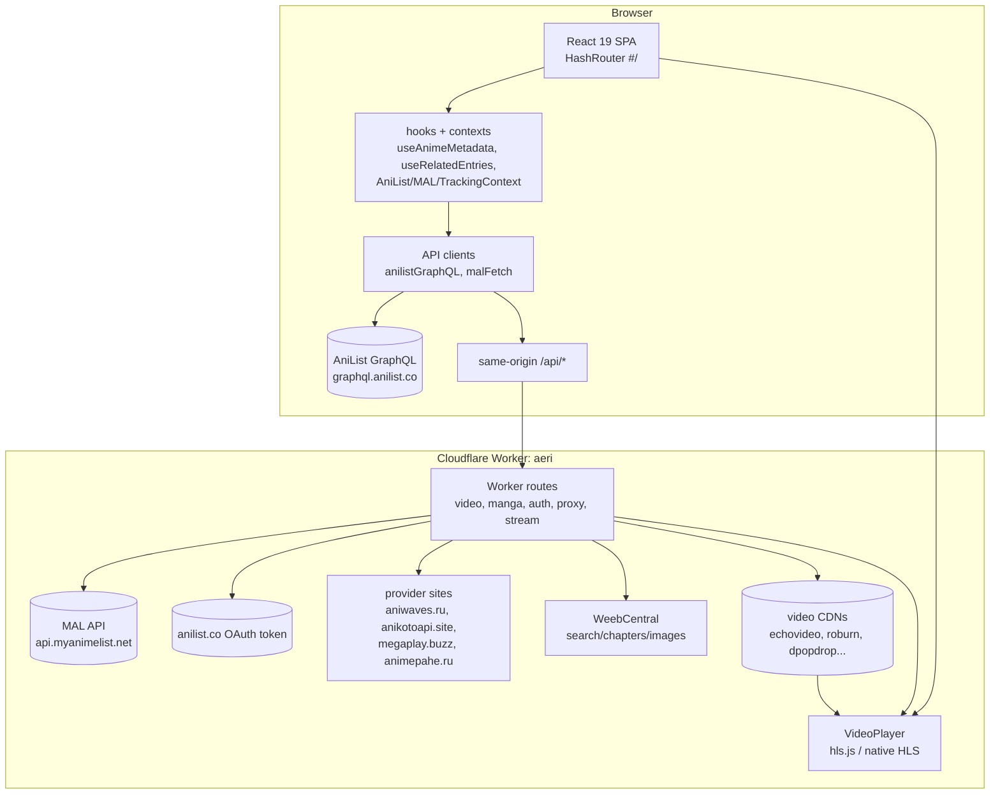

# Architecture — Aeri

The static frontend (`dist/`) is served by the **same Worker** that exposes
`/api/*`, so production is same-origin (no CORS gap). Localhost preview has
no Worker, so provider calls need `customVideoApiUrl` pointed at production.

## Frontend runtime

- Vite 8 + React 19 + TypeScript strict + Tailwind v4 (`@tailwindcss/vite`).
- `src/main.tsx`: applies persisted theme **before first render** (no flash),
  early MAL OAuth `?code=` handling, then renders `<App/>`.
- `src/App.tsx`: `HashRouter` (required — no server rewrites on Workers static
  hosting), providers `AniList → MAL → Tracking`, `Layout` (Navbar + Routes +
  footer). Routes: `/`, `/browse`, `/search`, `/list`, `/anime/:id` (one
  AniList entry — no season model), `/watch/:id/:episode` (this entry's
  episodes 1..N), `/read/:id/:chapter`, `/settings`, `/manga`, `/profile`,
  `*` → 404.

## Backend runtime

- Cloudflare Worker `aeri` (`worker/src/index.ts`), `compatibility_date`
  2025-09-01, `nodejs_compat`. Serves `dist/` assets + SPA fallback.
- See `backend.md` for routes, `streaming.md` for the video path.

## Request boundaries

| Boundary | Direction | Notes |
|---|---|---|
| Browser → AniList GraphQL | direct POST | CORS-open; all metadata/seasons/search |
| Browser → MAL REST | **blocked by CORS** | must go through Worker `/mal/api/*`, `/mal/token` |
| Browser → provider sites | blocked/challenged | Worker resolves server-side instead |
| Browser → video CDNs | signed URLs only | via Worker `/api/stream` relay (Range passthrough, playlist rewrite) |
| Browser → AniList token endpoint | never direct | secret lives in Worker/Deno only |

## External services

- **AniList GraphQL** (`graphql.anilist.co`): metadata backbone. Reduced
  ~30 req/min limit + burst limiter; honored via shared cooldown (see
  `anilist.md`). Detail queries include `relations { edges { relationType,
  node { ...lightweight } } }` — powers Related Entries with zero extra
  requests in the common case.
- **MAL** (`myanimelist.net` OAuth + `api.myanimelist.net` REST): PKCE `plain`
  only; token exchange + API through Worker proxy.
- **Deno auth service**: standalone `auth-proxy/` on non-Cloudflare hosting,
  same `/api/anilist/token` contract — required because AniList 403-blocks
  all Cloudflare egress IPs. URL baked as `VITE_AUTH_API_URL`.
- **Providers/CDNs**: aniwaves.ru (filter/ajax servers/embeds), anikotoapi.site
  (series JSON), megaplay.buzz (getSourcesNew), echovideo/roburn/dpopdrop CDNs.

## Data flow

- Public metadata: AniList → `anilistGraphQL` (memory 5m/400 + IDB 24h +
  inflight dedup) → shared `anilist:media:<id>` record → pages/hooks.
- Tracking: active tracker only (never merged) → `combinedList` → Home/MyList/
  Detail/Watch. MAL entries enriched with AniList display metadata (paced).
  Per-entry progress keyed by that entry's own AniList id — never shared
  across related entries.
- Related Entries: `useRelatedEntries(anilistId, relations)` ranks the
  entry's own relation edges in memory (zero requests); falls back to one
  cached relations-only query → `RelatedEntries` row (shared AnimeCard,
  direct `/anime/anilist-<id>` links). Navigation only — never identity.
- Video: Watch metadata → `/api/sources` (worker resolves + signs) →
  `/api/stream` relay → `VideoPlayer` (hls.js or native). Episode number in
  the URL is this entry's own episode (1..N).

## Authentication flow

- AniList: Authorization Code + `state`; browser → provider login →
  `?code=` return → exchange via Deno/Worker (`ANILIST_CLIENT_SECRET`
  server-side) → token in `storage/anilist`, viewer+list load. Navbar reopens
  sign-in popup on return (`sessionStorage aeri:signin:oauth`).
- MAL: PKCE `plain` (verifier = challenge, 96ch) → same callback shape →
  exchange via Worker `/mal/token` (injects `MAL_CLIENT_SECRET`) → tokens in
  `storage/mal`. Stuck `?code=` states are cleaned on any exchange failure.

## Media flow

Watch metadata (AniList, browser — exactly the routed entry) → hint params
(title/en/native/eps/format/year of THAT entry) → Worker
`resolveSource` (filter → match → servers → embed extract → sign) →
`/api/stream?u&e&s` → upstream CDN (playlist rewritten to signed URLs) →
`<video>` via hls.js (Chromium) or native HLS (Safari). Progress → IDB
`watchPos` (5s throttle) + tracker at ≥80% / on end. Fail-closed matching
means S3 can never play S1's stream: hints + episode-count checks pin the
exact entry.

## Anime identity (independent entries — no season system)

> **Anime entries are independent AniList media entities. AniList relations
> are used only as Related Entries/navigation context, not as an Anime
> identity or season-grouping system.**

- Canonical identity = AniList media id (`anilist-<id>`). S1/S2/S3 are three
  independent entities (own route, metadata, episodes, tracking, progress,
  provider matching, streaming, cache keys).
- No season selector anywhere (modal/page/watch). No franchise/group id.
  DetailModal and Watch render exactly the routed entry.
- `sanitizeAnimeForDisplay(anime)` is standalone (trailer filter + sort +
  local range check). `getDisplayEpisodeNumber` = per-entry global-offset
  detection only (streaming-title evidence); no group offsets.
- Titles: `getTitleHierarchy(anime)` — TV strips season suffix for display
  only (never identity/matching). Cards show `E<number>`, continue captions
  `E<number> • title`.
- Discovery never collapses: search/suggestions/browse keep every distinct
  AniList id. Continue Watching lists each watching entry (recency order).
- Related Entries ranking (deterministic, strongest → weakest):
  SEQUEL(0) PREQUEL(1) PARENT(2) CHARACTER(3) SUMMARY(4) ALTERNATIVE(5)
  SPIN_OFF(6) SIDE_STORY(7) ADAPTATION(8) OVA/ONA(9) SPECIAL(10) MOVIE(11)
  OTHER(12) unknown(99); ×10 + TV/ONA/OVA/SPECIAL/MOVIE/MUSIC format boost;
  ties by media id. Current entry excluded, deduped by id. Caption:
  `Relation • Format • N Episodes`.
- Caches: `anilist:media:<id>` per entry (shared record, no group keys);
  `anilist:related:<id>` (mem 30m/100 + IDB 24h + inflight). No persisted
  data migration: all progress was already per-AniList-id — group records
  simply go unused.

## Caching / persistence

- Memory (module maps) + IndexedDB (`aeri` v2: `progress`, `cache`,
  `history`, `watchPos`) + `localStorage aeri:prefs` (settings).
- AniList: memory 5m + IDB 24h + shared inflight + stale-while-throttled.
  Detail `relations` ride on the same Media query (no extra request).
- Related entries: memory 30m/100 + IDB 24h + per-id inflight
  (`anilist:related:<id>`); one relations-only query only when the entry's
  own edges aren't held.
- Video: browser mem 5m (empty 2m) + IDB 1h (empty 5m); signed URLs never
  cached; resolver caches 5–10m.

## Error handling

- `ProviderError` codes: `NETWORK` (retryable), `AUTH`, `NOT_FOUND`,
  `UNKNOWN`, `THROTTLED` (machine-readable; hooks keep cached pages silently).
- Watch: `Video unavailable` (no compatible source) vs `Couldn't load video`
  (transient), with Retry; never fake URLs, never demo-as-proof.

## Security boundaries

HMAC-signed expiring stream URLs (6h) minted only by resolve path;
allowlisted https hosts; DoH private-IP reject fail-closed; strict title/
season/episode/format/year matching (fail closed); secrets only in Worker
secrets / Deno env / owner keychain — never in bundles. See `security.md`.
