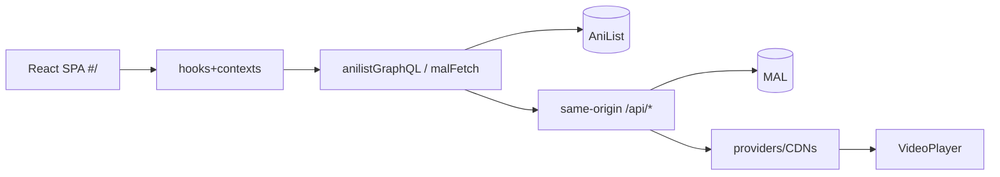

# Aeri — one-go project context

> Deep docs live in `agents/`. The codebase is the ultimate source of truth —
> if this file conflicts with code, inspect the code and fix the file.

## What Aeri is

Minimal anime discovery/tracking/watching web app that feels like a
purpose-built streaming service. Loop: open → discover → watch → progress
remembered → MAL/AniList synced. Plus a real Manga browse tab (no reader).

## Stack

Vite 8 · React 19 · TypeScript strict · Tailwind v4 · HashRouter · Context +
hooks (no Redux) · `hls.js` · Cloudflare Worker (`aeri`) serving `dist/` +
`/api/*` · Playwright · `oxlint`.

## Architecture

Same-origin production (`aeri.fastdemo.workers.dev`): browser owns AniList
metadata (Worker egress is IP-blocked); Worker owns MAL proxy, provider
resolution, signed `/api/stream` relay; player uses hls.js (Chromium) or
native HLS (Safari).

## Major systems

- **Frontend**: `main.tsx` (theme pre-apply, MAL callback) → `App.tsx`
  (HashRouter, 10 routes, footer) → pages/components (see `agents/ui.md`).
- **Backend**: Worker routes for health/map/episodes/sources/auth/MAL/stream/
  diag; pinned-provider fast path; demo never auto-included.
- **AniList**: single client (memory 5m/400 + IDB 24h + inflight dedup +
  shared 429 cooldown, no retry, stale serve); spine-walk seasons
  (TV-only, fail closed); per-tracker scores.
- **MAL**: PKCE `plain`, Worker token/API proxy, single-active-tracker (no
  merges), paced AniList enrichment.
- **Streaming**: aniwave-first registry → worker `resolveSource` (filter →
  threshold-40 match → servers → embed extract) → signed relay → player;
  progress via throttled IDB + tracker. Upstream lottery is the ceiling.
- **Manga**: `useMangaBrowse` (`type: MANGA`), chapters/volumes, same UI.
- **Recommendations**: deterministic genre-overlap scoring; Because row =
  single mixed A/B interleave; Top Picks from list genres.
- **Seasons**: route id = selected season; selector navigates to canonical
  entries; idempotent groups; movies/OVAs excluded.
- **Settings**: ~20 controls, all real except Reduced-motion readout;
  toggles/order/URL apply on next resolve; theme grid (17 palettes).
- **Themes**: 17 CSS vars via `applyTheme` (no rerender), persisted,
  pre-paint init; components use tokens/`color-mix` only.
- **Caching**: shared `anilist:media` record (1 cold / 0 warm page cost);
  series models 30m/100 + 24h; video mem/IDB TTLs; signed URLs never cached.

## Routing

`#/` Home · `#/browse` Anime · `#/manga` · `#/search?q=` · `#/anime/<id>` ·
`#/watch/<id>/<ep>` · `#/list` · `#/settings` · `#/profile` · `*` 404.
Signed-out: cards/hero/search → sign-in; media/list/settings/profile → home.

## Data flow

Metadata AniList→cache→UI; tracking active-tracker-only; seasons parallel
walk→selector→canonical nav; video hints→resolve→sign→relay→play→progress.

## Deployment

**Cloudflare is the target** (`wrangler deploy --env production`, never
`aeri-production`); build bakes `VITE_*` IDs; verify with `verify:live` +
bundle grep + Playwright on the live URL. **GitHub untouched** unless
explicitly asked.

## Critical constraints

Fail closed on matching; no demo-as-proof (playback = `currentTime`
advancing); no secret values anywhere; no torrents/proxies/protection
bypasses; no retry storms; no per-tick React state; Worker/AniList-IP-block
and MAL-CORS realities respected.

## Current state

Working: discovery, tracking, seasons, aniwave streaming (incl. Re:Zero),
manga browse, themes, gates, resilience. Partial: next-resolve prefs,
enrichment tail, unwired keys. Broken: none known. Limits: upstream
throughput, single-rendition HLS, no Safari hardware tests.
